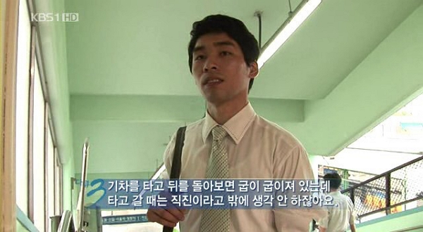
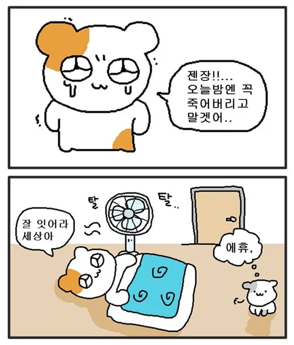

헉 벌써 우여곡절 1주일이 지났습니다  
이렇게 부스트캠프 4주 간의 챌린지 중 반절이 지났네요

<figure>

<figcaption>
부스트캠프 미션 하다보면 벌써? 소리가 절로 나오는
</figcaption>

</figure>

저번 주에는 부스트캠프라는 것을 처음 접하니까  
할 말도 많고.. 느끼는 것도 많고.. 그랬는데  
이제는 저번 회고에서 생각한 **학습과 구현의 밸런스를 잘 맞추기**에 좀 더 신경을 쓰려고 했습니다  
2주차 와서 또 다른 좋은 스터디그룹 팀원들도 만나고.. 아주 좋았네요

특히 저번 주에는 짝 설계만 있었는데  
짝 프로그래밍까지 하게 되어 배운 것이 많습니다  
『개발자 원칙』에서 김정 코드스쿼드 대표이사님이 말씀하시길  
"결과를 향하되 과정을 돌아보자" 하셨습니다  
짝 프로그래밍처럼 옆에 함께 하는 사람이 있으면  
방향을 잃고 폭주하는 나를 잠깐 멈춰 세운 뒤  
과정을 돌아보고, 다시금 목표와 방향을 인식하는 기회가 많았습니다  
함께 하면서 많이 배웠네요

<figure>

<figcaption>
KBS2 '다큐멘터리 3일'
</figcaption>

</figure>

## 『개발자 원칙』

말 나온 김에 이 책에 대해 좀 더 쓰겠습니다.  
이 책은 여러 CTO급의 고수분들께서  
지나온 커리어들을 생각하며.. 아 이렇게 하니까 좋더라.. 이런 이야기를 해주십니다

김정님의 이야기는 "나의 메이저 버전을 업그레이드하는 마이너 원칙들"입니다  
소프트웨어가 버전이 끊임없이 올라가듯이, 개발자들도 지속적으로 성장해야 하죠

그 중에서는 **개구리를 해부하지 말고 만들어라**라는 이야기가 있습니다  
잘 이해하려면 들여다 보지만 말고 직접 한번 해봐라.. 이런 것인데  
부스트캠프하면서 많이 느낍니다. 백날천날 그 동작이고 뭐고.. 배워봐야  
한 번 만들어보고 부딪혀보는 것이 매우 효율적이더랍니다

또 하나, **여러 해결책을 제시하고, 공유하고, 비교하여 서로 납득할 기준을 제시**하자는 내용이 있습니다  
개발하면서 해결책은 정해져 있는게 아니더라고요..  
여러 방법이 있고, 각자의 장단점이 있습니다  
그리고 협업을 하다 보면 그 중 뭘 선택할지 의견이 다를 수 있는데  
서로 납득할 기준을 제시하는 것.. 매우 중요하네요  
응당 선택이란 근거가 있어야 하겠죠  
오픈소스 문화는 이러한 과정을 거친다는 점이 가장 큰 장점 중 하나고  
커뮤니티 또한 궤를 같이 합니다  
저도 오픈소스 컨트리뷰션 프로젝트를 시작하게 됐는데  
이런 경험 더 할 생각에 매우 좋네요

그리고 이동욱(향로)님의 글도 재밌게 봤는데  
특히 이 분께서 쓰신 책으로 처음 스프링을 배웠어서 더 와닿은 것 같기도.  
아무튼 **제어할 수 없는 것에 의존하지 말고, 제어할 수 있는 것에 집중하자.** 라는 말을 해주십니다  
개발이나 현실 생활이나 마찬가지로요  
쉽게 통제되지 않는 변인들에 의존하려 하면  
개발에서는 테스트같은거 하기도 힘들고, 현실에서도 그런다고 해서 상황이 나아지지 않습니다  
저도 평상시 꽤나 이러려고 노력하는 편입니다  
어쩔 수 없는 것은 어쩔 수 없는 거고.. 내가 할 수 있는거라도 해야지, 이런 느낌  
개발 측면에서도 꽤나 그래야 할 것 같네요  
최근에 GPS 정보 따와서 사용자가 이동한 경로를 지도에 표현하는 기능을 개발하게 되었는데  
이거 테스트를 좀 용이하게 하려면 그런 부분 신경써야 할 것 같아요  
이렇게 또 인사이트를 얻었네요

---

## 앞으로도 화잇딩

아무튼 머.. 남은 2주 힘내보겠습니다

앗. 맞다. 학습정리 모아서 여기에 올리려고 TIL 페이지를 따로 만든건데.. ㅜㅜ
