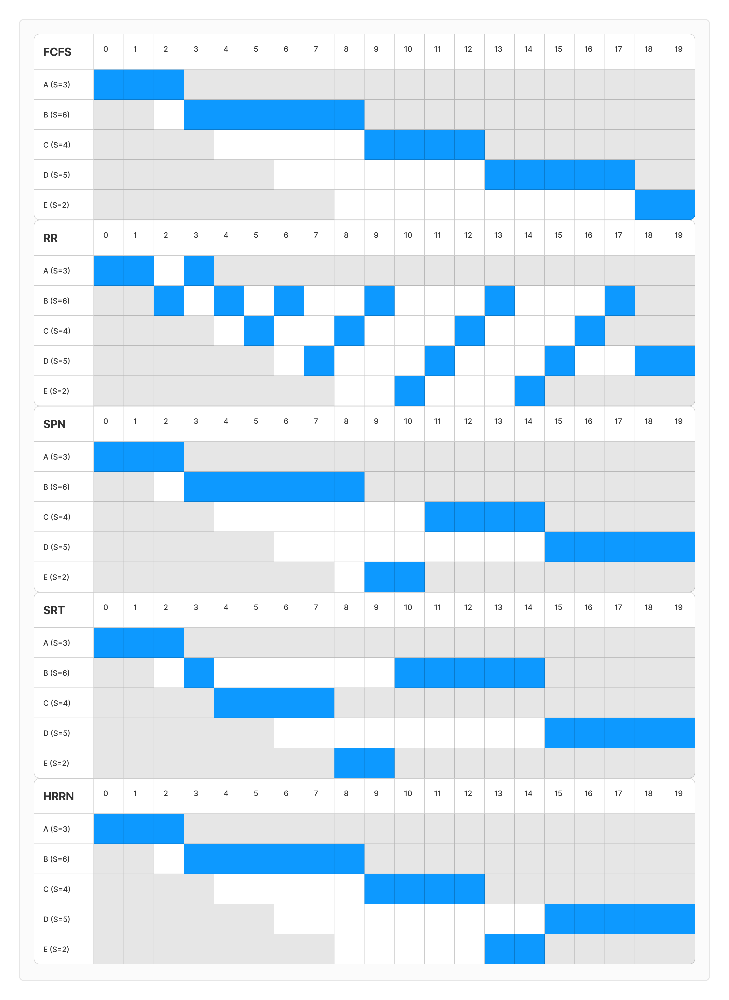
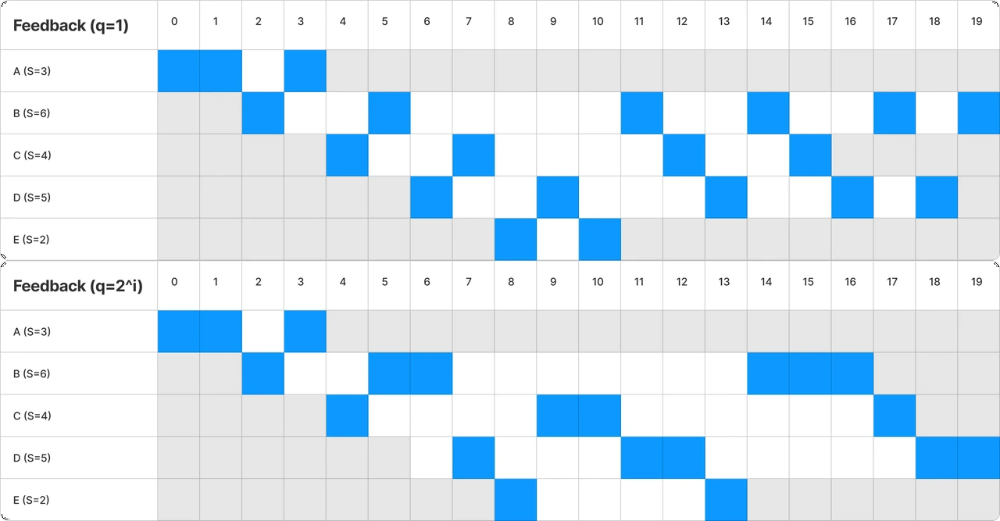

프로세서나 스레드들은 CPU가 본인을 가져다 실행해주기를 기다리며 레디 큐에 줄을 섭니다.  
마치 계산대 앞에 줄 서는 사람들처럼요

<figure>

<figcaption>무인 계산대 ㅋㅋㅋ
</figcaption>

</figure>

무릇 가게들은 계산을 많이 해줘서 돈을 많이 벌고 싶어합니다  
계산대를 막 백 개, 천 개, ...씩을 두면 물론 좋겠지만  
그럴 여건은 안 되고 계산대를 하나밖에 둘 수 없다면  
어떻게 계산을 해줘야 잘 해줬다고 소문이 날까요?

이번 시간에는 이렇게 계산대가 하나인 상황처럼, 프로세서가 단 하나일 때 스케줄링을 어떻게 하면 좋을지 알아봅시다

아, 근데 스케줄링에는 Long / Mid / Short Term 세 가지 유형이 있는데  
"READY QUEUE에서 다음에 실행할 프로세스 고르기"는 Short-Term 스케줄링에 해당합니다  
스케줄링의 성능과 가장 직결되는 것 또한 이 Short-Term 스케줄링이고, 앞으로 말하는 내용들 또한 이에 대한 내용입니다

# 스케줄링 목표

그런데 스케줄링을 잘 하는 것의 기준이 뭘까요?  
여러 기준들이 있는데요

- Response time : (입력을 시작 ---> 출력!) 까지의 시간 간격
- Throughput : 단위 시간 동안 프로세스를 몇 개나 처리했는가?
- Processor efficiency : CPU가 전체 시간 중 유효한 작업(= 유저 프로그램 실행)을 수행한 비중(%)
- Fairness : 같은 조건의 프로세스들이 공정하게 실행 기회를 가져가는 것
- Predictabillity : 실행 시간의 예측 가능성

이 중 Response Time같은 것들은 유저의 입장에서 느끼는 지표인 반면,  
Throughput같은 것들은 시스템 입장에서 보는 지표이고  
Response Time이나 Throughput은 성능과 직접적으로 관련있고 측정 가능한 반면,  
Fairness같은 것은 성능과는 꽤나 무관하고 측정 불가한 지표인 등  
뭐가 더 중요한지 정하려고 해도 관점에 따라, 입장에 따라 변하기 마련입니다

마치, 계산대에 선 사람들은 그저 "내가 기다리는 시간"만 짧으면 되고  
점주 입장에서는 매출이 얼마냐, 이런게 중요할 것입니다

<figure>

<figcaption>돈!!!!
</figcaption>

</figure>

인생이 그렇듯이 모든 토끼들을 다 잡을 수는 없습니다  
모든 지표들을 만족하는 것은 불가능하므로 하나의 기준점을 잡아야 하겠는데  
그 정한 기준점을 우선순위로 하여 스케줄링을 하고,  
그 우선순위에 따른 여러 레벨의 ready queue를 운용하고, ... 해야겠습니다

아 그리고 조심해야 할 문제가 있는데  
**starvation**이라는 것입니다  
어떤 프로세스가 평생 차례를 얻지 못하고 왕따를 당하는 것인데요 ㅜㅜ  
점주가 너무 매출같은 것에만 신경쓰면서 젤리 하나만 사려는 사람들은 등한시한다면  
손님들이 아주 불같이 화가 날게 뻔합니다  
이런 상황은 좀 없도록 해야겠습니다

# 스케줄링의 종류

## FCFS (First-Com-First-Served)

이건 그냥 **선착순**입니다. 그냥 보통 우리가 계산대를 이용하듯이요

<figure>

<figcaption>
</figcaption>

</figure>

- Non-Preemption : 일단 실행을 시작하면, 차례를 넘기지 않습니다.
- 전체 Response Time은 줄일 수 없겠네요. 노력조차 안 했고
- 매우 공정하고, starvation 가능성도 없고, 예측 가능성도 뛰어납니다.

## RR (Round-Robin)

**번갈아** 실행시킵시다. 마치 불침번 근무.. 아니면  
이 경우는 자기 차례가 오면 좋으니까  
어릴 때 형제들과 컴퓨터를 사이좋게 1시간씩 나눠 쓰는 것처럼?요

이 경우 먼저 정해야 할 것이, Time Quantum $q$ 입니다.  
언제마다 교대할지 시간을 정해야겠죠?

- Preemption : 실행을 시작한 후 $q$만큼의 시간이 흘렀다면(time-out), CPU 사용을 중단시킵니다.
- 전체 Response Time은 $q$를 어떻게 정하느냐에 따라 직결됩니다
- FCFS에서와 비슷하게, 레디 큐에 도착한 순서대로 우선순위를 갖는 셈이고, 매우 fair하면서 predictability 또한 높습니다.

## SPN (Shortest Process Next)

**Service Time(실행 시간)이 짧은 프로세스들**부터 실행시키는 방법입니다.

<figure>

<figcaption>버0.. 똥싸면 응당 오래 걸리니까, 늦게 올 수 밖에
</figcaption>

</figure>

- Non-Preemption : 일단 실행을 시작하면, 끊지 않습니다
- Response Time을 꽤나 줄이는 방법인데, **실행 시간이 짧은 프로세스를 빨리 완료시킨 다는 점**이 한 몫 합니다.
  - 마트에서, 100만원어치 사는 사람 한 명(A), 그냥 젤리 하나 사는 사람 한 명(B)이 있다고 합시다.
  - A가 먼저 계산을 시작해버리면, B는 긴 시간을 하염없이 기다리게 됩니다 ㅜㅜㅜ
  - 반면, B 먼저 계산하게 하면, B는 하나도 기다리지 않고, A도 딱히 별로 기다리지 않습니다.
  - 기억 하시나요? Response Time은 "줄 서서 기다리고 있었던 시간의 합"입니다.
- 그렇지만 문제는, Predictability가 낮고, 그럼 실행 시간이 큰 애들은 starvation에 빠져버릴 수 있습니다.

이 실행 시간의 예측이 아무리 쉽지 않다지만, 그래도 좀 해보려면 방법은 있습니다  
지금까지의 **실행 시간 기록들로부터** 평균을 계산하여 **예상**해보는 것인데요

- $T_i$ : 실행 시간 기록 중 $i$번째
- $S_i$ : 실행 시간 예측 값 중 $i$번째
- 이제, 간단히 **산술 평균**으로 해보면 : $S_{n+1} = \frac{1}{n}\sum^n_{i=1}T_i$
- 좀 더 정확히 해보려면, **가중치 평균**을 사용하여 : $S_{n+1} = \alpha T_n + (1-\alpha)S_n$ 이런 식으로 재귀적인 계산을 할 수도 있습니다.

## SRT : Shortest Remaining Time

SPN에서 preemptive를 한 스푼 얹어서, **남은 실행 시간이 가장 짧은 프로세스**를 실행하는 방법입니다.

- preemptive : (남은)실행 시간이 적은 순으로 실행하고, 나보다 더 우선순위가 높은 프로세스가 나타나면 중단합니다.
- 이러면 Response Time을 진짜 최대로 줄여볼 수 있습니다.
- 반면.. SPN에서 해결되지 않았던 문제들은 더 심해졌습니다..

## HRRN (Highest Response Ratio Next)

흠.. 그럼 **실행 시간과 기다린 시간을 함께 고려**하면 어떨까요?  
좀 더 합리적이지 않을까요? fairness도 좀 높이고..

그래서 **Ratio**를 계산하고, 이 값이 가장 높은 순으로 실행을 하기로 했는데  
실행 시간(Service Time)을 $S$, 대기 시간(Waiting Time)을 $W$라고 하면
$Ratio = (W+S)/S = 1+W/S$ 와 같이 $Ratio$값을 계산합니다.

- Non-Preemptive : 제곧내
- Response Time은 성능을 중시하던 SRT, SPN과, fairness를 중시하던 FCFS, RR의 중간 정도의 성능이 됩니다
- starvation 발생 가능성이 없어졌고, 예측 가능성도 높아졌습니다

## Response Time을 실제로 계산해보면

예시로, 아래와 같이 프로세스들이 들어온다고 해봅시다

| process | Arrival Time | Service Time |
| ------- | ------------ | ------------ |
| A       | 0            | 3            |
| B       | 2            | 6            |
| C       | 4            | 4            |
| D       | 6            | 5            |
| E       | 8            | 2            |

Arrival Time은 레디 큐에 프로세스가 도착한 시간,  
Service Time은 실행 시간(CPU 사용 시간)이 되겠습니다

지금까지 소개한 5가지 방법들로 스케줄링하면 어떻게 될까요?

세로 축은 프로세스(A,B,C,D,E), 가로 축은 Time(0, 1, 2, ...)입니다.  
각 Time마다 적절한 프로세스를 선택하여 실행(파란색 칸)합니다.  
아직 프로세스가 도착하지 않았거나, 프로세스 실행이 끝났다면 회색으로 처리했습니다.

그럼 이제 각 방법들마다, 전체 Response Time = (파란색 칸) + (흰색 칸) 과 같습니다

1. FCFS : $((0+3)+(1+6)+(5+4)+(7+5)+(10+2))/5=43/5$
2. RR : $((1+3) + (10+6) + (9+4) + (9+5) + (5+2))/5 = 54/5$
3. SPN : $((0+3) + (1+6) + (7+4) + (9+5) + (1+2))/5 = 38/5$
4. SRT : $((0+3)+(7+6)+(0+4)+(9+5)+(0+2))/5 = 36/5$
5. HRRN : $((0+3)+(1+6)+(5+4)+(9+5)+(5+2))/5 = 40/5$
   - Time 9에서, $Ratio(C) = 1+5/4 = 2.25, Ratio(D) = 1+3/5 = 1.6, Ratio(E) = 1+1/2 = 1.5$
   - Time 13에서, $Ratio(D) = 1+7/5 = 2.4, Ratio(E) = 1+5/2 = 3.5$

어라? 그런데 FCFS보다 RR이 더 느리네요?  
이게.. RR에서 이야기한 것 처럼, Time Quantum값을 적절히 정해줘야만 FCFS보다 줄어들게 해줄 수 있습니다.  
대충 정하면 이렇게 된다는 뜻

SRT, SPN이 굉장히 빠른 Response Time을 보여주는데  
마트의 예를 들며 설명했듯이  
**빨리 끝나는 프로세스 먼저 끝내는 것**이 굉장히 중요했네요

## 그래서.. 뭐 쓰는게 좋은가요?

그런데 5개 전부.. 써먹기에는 함정이 많습니다

- response time에 집중하려면 SRT 또는 SPN인데..
  - starvation 가능성이 존재하고, 예측 가능성도 구립니다
  - response time을 계산하여 예측해볼 수야 있지만, "계산"한다는 점 자체가 단점인게..
    - OS의 개입이 추가로 필요해서, 복잡해진다는 문제점이 있습니다
- 그렇다고 FCFS, RR 쓰기에는..
  - response time이 너무 길어집니다..
- 균형의 수호자 HRRN은 어떤가요?
  - 얘도 ratio를 매번 계산해야 하니 간단하지 못합니다.

그럼 어떡하죠?

## Feedback

지금까지는 성능을 높이려면, "실행 시간이 짧은 프로세스에게 우선권을 주자" 마인드였는데  
반대로, **실행 시간이 긴 프로세스에게는 패널티**를 주면 어떨까요?  
자연스럽게 실행 시간이 짧은 프로세스는 우선권을 얻게 될 것입니다

- 이번에도, **Time Quantum** $q$를 정합시다.
- 실행을 시작한 뒤 $q$만큼 지나면 time-out 시킵니다. (Preemptive)
- 이러면 **실행 시간이 짧은 친구들은 하위 레벨 큐로 가기 전에 끝나고, 긴 친구들만 밑바닥에** 남습니다.
- 프로세스들은 **multi-level queue**에서 대기합니다($RQ_0$ ~ $RQ_n$)
  - $i$번째 큐에서 나와서, block 또는 time-out 등, 실행이 중단되면, $i+1$번 큐, 즉 하위 레벨 큐로 내려갑니다.
  - 그러다 밑바닥인 $RQ_n$에 도달하면, 더 내려갈 곳이 없으니 여기서는 RR방법을 따릅니다.
- 물론 이론적으로 starvation 가능성이 존재하지만,
  - CPU 속도는 너무 빠르고, 프로세스들은 자주 I/O작업하러 놀러가므로, 실제로는 보통 모든 큐가 비어있는 경우가 허다합니다..
  - 또한, $q=2^i$와 같이 정해서, starvation 가능성을 더 낮출 수 있습니다.
    - _어라? 그럼 0번 큐는 $q=1$, 10번 큐는 $q=2^10=1024$가 되는데, 실행 시간이 긴 애들한테 패널티를 준다면서요??_  
      => 어차피 실행 시간이 짧으면 이미 내려오기 전에 끝났을 것이고, 실행 시간이 길어서 밑바닥까지 간 친구들은 실행할 기회조차 별로 없습니다..  
      => 그러니 한 번 실행할 때 아주 꿈을 펼쳐봐라, 끝내봐라. 이런 목적입니다.

# (Traditional) UNIX에서 쓰는 Scheduling

실제 사례를 하나 봅시다.  
옛날 UNIX 시스템은 프로세서가 하나 뿐이던 시절에 맞는 스케줄링 기법을 사용했는데

기본적으로 **Feedback 기반의 Multi-Level Queue**를 사용합니다.  
위에서 살펴본 Feedback 방법과 다른 점은

- 같은 우선순위를 가지는 프로세스끼리는 :
  - 하나만 있으면, 혼자 계속 실행(FCFS)
  - 둘 이상 있으면, RR
- **time-out이 되어도 아래쪽 큐로 가지 않고**, 대신 **정해진 시간(ex. 매 1초)마다 우선순위를 다시 계산**하여 재배치합니다.
- 우선순위 구성 :
  - $P_j(i)$ : $i$번째로 계산된 $j$ 프로세스의 우선순위
  - $Base_j$ : $j$프로세스에게 주어진 기본 우선순위 값(하는 일에 따라)
  - $nice_j$ : 유저가 조정할 수 있는 우선순위 값. systemcall로 이를 조정할 수 있다
  - $CPU_j(i)$ : CPU 사용량만큼 패널티를 받는 값. 자세한 계산은 아래서 살펴봅시다.
  - 이제 $P_j(i) = Base_j + CPU_j(i)/2 + nice_j$처럼 나타낼 수 있는데, $Base$는 워낙에 커서 이 클래스가 다르면 역전은 꿈도 꿀 수 없습니다
- 우선순위 계산 : $CPU_j(i) = CPU_j(i-1)/2 = U_j(i-1)/2 + U_j(i-2)/4 + U_j(i-3)/8 + ...$
  - 이 때, utilization 값인 $U_j(i-k)$ 는 : $j$번 프로세스가 저번에, 저저번에, 저저저번에, ... CPU를 차지했던 비중. 입니다.
  - 즉, 각 interval마다, **내가 얼마나 CPU를 차지했었는지에 따라 패널티**를 가져갑니다.
  - 또한 시간이 지날수록 $/2, /4, /8, ..$과 같이, **패널티가 반감**됩니다.
- **Fairness를** 많이 챙기고자 했음을 알 수 있네요.

---

\
다음 시간에는 계산대가 여러 곳 있는  
Multiprocessor 환경에서의 스케줄링으로 다시 찾아오겠습니다

이만 마칩니다.
