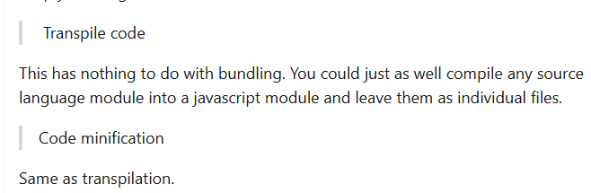
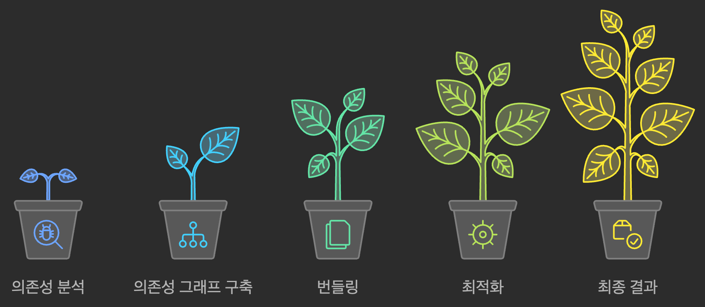
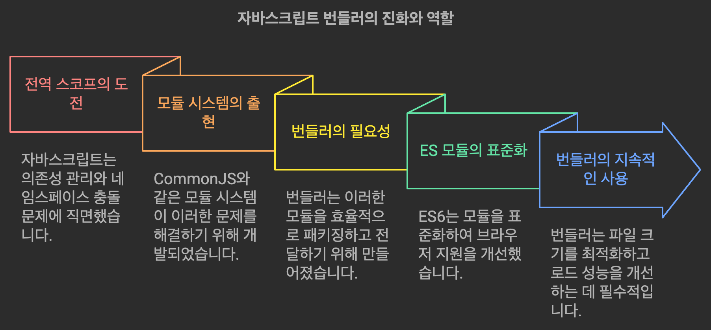

기술면접에서 긴장한 상태로 앉아있다가..

> 웹팩, Vite같은 번들러의 역할이 뭔가요?

물으시는 것을 듣자마자  
아차.. 사실 매일같이 옆에 있으면서도 잘 모르고있었구나, 깨달았습니다

지식이 부족한 채로 어떻게든 대답할까 싶어 한 두 마디를 이어가다가  
구멍을 하나 막으려고 보니 두 군데서 또 물이 새고 있는 자신을 발견하고는.. 모르겠다 했습니다.


천둥벌거숭이가 된 기분이라고 할까요?

그래서 자세히 좀 알아봤습니다..

# 태초에 어떤 문제가 존재했는가?

모듈 시스템이 나오기까지 어떤 배경이 있었는가?에 대해서 [MDN 문서](https://developer.mozilla.org/ko/docs/Web/JavaScript/Guide/Modules#a_background_on_modules)에서도 다루고 있습니다. 궁금하시면 참고하시구요

웹 페이지는 웹 문서 뼈대 그 잡채인 HTML, 옷을 입히는 CSS, 그리고 움직이게 하는 JS로 이루어집니다  
만약 웹 페이지에 자바스크립트 파일을 로드하려면..  
`<script src="index.js">`처럼 스크립트 태그로 삽입하겠죠?

예시로, 간단한 HTML에 간단한 JS코드를 집어넣는 코드를 작성해봅시다.

```html
<html>
  <head>
    <link
      rel="stylesheet"
      href="https://cdn.jsdelivr.net/npm/@picocss/pico@1/css/pico.min.css"
    />

    <meta charset="UTF-8" />
    <meta name="viewport" content="width=device-width, initial-scale=1.0" />
    <title>Very Simple Traditional App</title>
  </head>
  <body>
    <div style="width: 20%; margin: 30vh auto">
      <button id="redirect-page-btn">Redirect</button>
      <button id="say-hello">Say Hi</button>
    </div>
  </body>
  <script src="foo.js"></script>
  <script src="redirect.js"></script>
  <script src="alert.js"></script>
  <script src="index.js"></script>
</html>
```

```js
----------------------------------------------
//foo.js
function bar() {
    // do nothing
}
const baz = "baz";
----------------------------------------------
// alert.js
function SayHi() {
    alert("Hello, My Name is..");
}
----------------------------------------------
// index.js
document.getElementById("say-hello").addEventListener("click", SayHi);
----------------------------------------------
```

간단한 html 요소들을 두고, pico css를 CDN으로 삽입하여 대강의 스타일만 넣었습니다.
그리고 여러 자바스크립트 파일을 삽입했습니다.

JS코드들이 여러 파일로 분리되어있지만, 자바스크립트는 기본적으로 **전역 스코프를 공유**합니다.  
따라서 별도의 작업 없이도 서로 스스럼 없이 지낼 수 있습니다  
예를 들면 `index.js`에서 `alert.js`의 `SayHi()`함수를 사용하는 등..


이러면 에브리띵 오케이일 것 같지만 여러가지 지뢰가 도사립니다..

## 1. 네트워크 요청은 파일 수만큼 보냄

먼저 개발자모드를 열고 네트워크 탭에서 전송된 요청을 봅시다


세 개의 자바스크립트 파일을 삽입했으니, 이를 로드하기 위해 세 번의 요청이 필요합니다.  
심지어 하등 사용하지도 않은, 그래서 필요하지도 않은 `foo.js`까지도요

이렇게 아무리 용량이 작아도 자바스크립트 파일을 100개로 나눠놓았으면 100번의 요청이 필요합니다..

## 2. 의존성을 조심

또한 이 스크립트를 삽입할 때는 의존성 관계를 잘 생각해야 할텐데, 예를 들어 아래처럼 되어버리면..

```html
<script src="foo.js"></script>
<script src="index.js"></script>
<script src="alert.js"></script>
```


에러가 발생해버립니다.  
`alert.js`에서 `SayHi()`가 선언되기도 전에 `index.js`에서 참조했으니까요

## 3. 전역 스코프 오염

이제 만약 이걸 작성한 저 말고 다른 새로운 사람이 와서 여기에 코드를 작성한다고 해봅시다.  
그러고는 이런 생각을 할 수도요? "_`baz`라는 변수를 만들어야지~_"

```js
document.getElementById("say-hello").addEventListener("click", SayHi);

const baz = "bazbaz";
console.log(baz);
```

어라, 근데 이미 `foo.js`에 `baz`라는 변수가 선언되어 있습니다.  
이 사실을 알지 못하는 사람이라면, 영문도 모른 채 이런 에러를 마주치게 됩니다.


이러면 이제 나중가면 게임 캐릭터 이름 지을때마냥 변수 중복확인이라도 해야하겠는데요?

<figure>


<figcaption>게임 "메이플스토리"의 닉네임 중복확인..</figcaption>

</figure>

### 함수는 덮어씌워지더라구요

처음에는 이 예시 `baz`를 함수로 하려고 했는데,

```js
// foo.js
function bar() {
  // do nothing
}
function baz() {
  // do nothing too
}
// index.js
document.getElementById("say-hello").addEventListener("click", SayHi);

function baz() {
  console.log("baz");
}
console.log(bar);
```

그런데 웬걸? 에러가 나지 않았습니다.


나중에 정의한 함수로 `bar`함수가 덮어씌워졌네요?

[호이스팅](https://developer.mozilla.org/ko/docs/Glossary/Hoisting)과 관련이 있다고 합니다.

> JavaScript 호이스팅은 인터프리터가 코드를 실행하기 전에 함수, 변수, 클래스 또는 import 등의 선언문을 해당 범위의 맨 위로 끌어올리는 것처럼 보이는 현상을 뜻합니다.

자바스크립트 인터프리터가 전체 함수 선언을 전부 긁어서 현재 속한 스코프의 최상단으로 끌어올리게 되는데,  
이 과정에서 중복된 함수가 있다면 나중에 가져온 것으로 덮어씌워지게 됩니다.

라는 것 같네요. 아무튼 이렇게 덮어씌워버리는 경우에도 아주 난감해지겠습니다..  
제 입장에서는 어느 날 `baz`함수가 다른 동작을 해버리는 사태가 발생하고 맙니다 ㅜㅜ

암튼간에 이렇게 살펴본 것처럼

- 쓰지도 않은 파일까지 로드하게 되고,
- 파일 하나 당 하나의 요청이 있어야 하고(단 1byte짜리 파일이어도!)
- 의존성에 따라 스크립트 삽입 순서를 신경써야 하고,
- 스코프를 전역으로 공유하므로 충돌 가능성이 산재하고,
- 등등..

이건 프로젝트의 규모가 커지면 커질 수록, 파일과 코드가 많으면 많아질 수록 문제가 커집니다..  
그리고 만약 여러 스크립트 파일을 삽입했는데, 일부 파일이 문제가 생기면 이것이 전체 스크립트의 실행을 블락해버릴 수 있습니다

이런 문제 때문에 **모듈화**를 통해 각자 파일의 독립을 보장하고, 이것을 잘 모아서 묶고자 하는 니즈가 생겨났습니다

<figure>


<figcaption>검정고무신 中</figcaption>

</figure>

# 그래서 등장한 모듈 시스템과 번들러

이로 인해 태초에 **CommonJS**와 **AMD**라는 모듈 시스템이 제안되었는데

- AMD(Asynchronous Module Definition) : 비동기 방식으로 `define`함수를 사용하여 모듈 api와 의존성 관계를 정의하는 방식
  - 브라우저에서 바로 사용 가능했지만, 너무 직관적이지 않은 문법이 단점이었대요
- CommonJS : 동기 방식으로 `require`를 사용하여 의존성 모듈을 가져오고, `module.exports` 객체로 모듈 api를 정의하는 방식
  - 브라우저 이외의 환경에서 사용하고자 만들어졌기에 브라우저에서 쓰려면 별도의 작업이 필요했습니다
  - 대신에 Node.js에서 이를 기본으로 사용해서 널리 쓰이게 되었습니다

그러다가 ES6에서 새로운 모듈 방식이 표준으로 채택되고 이를 **ESM(ES Module)** 이라고 부르게 됩니다

- `export/import`로 모듈을 내보내고 가져오는 방식
- 초기 ESM은 정적 `import`만 가능했지만, ES2020부터 동적 `import()`구문이 도입되었습니다
- ESM의 정적 import방식은 Tree-Shaking같은 최적화 과정을 수행하기 용이하게 해주었습니다. 이에 대해서는 나중에 알아봅니다

이렇게 모듈을 나누었으면 브라우저 환경에서 사용할 수 있게 **다시 묶는 과정**이 필요했습니다  
ESM이 표준화된 이후 시간이 지나 대부분의 브라우저에서 ESM을 지원하게 되며 꼭 그러한건 아니게 되었지만요  
그래도 일단 CommonJS는 별도의 번들링이 필요한거고, ESM이 표준화된 이후 얼마 지나지 않았을 때는 아직 번들링이 필요했습니다

그런데 지금은 ESM이 표준화된 ES6 등장 이후 10년 가까이 지났습니다  
이제 거의 모든 브라우저가 ESM을 기본적으로 지원하는데,  
그럼 왜? 굳이 번들러가 아직도 필요할까요?

# 번들러를 아직도 써야 하는 이유

[Vite 가이드](https://ko.vite.dev/guide/why.html)에서는 배포 시 번들링 과정이 아직도 필요한 이유에 대해 이렇게 말합니다.

> 이제 기본적으로 ESM이 대부분의 환경에서 지원되지만, 프로덕션에서 번들되지 않은 ESM을 가져오는 것은 중첩된 import로 인한 추가 네트워크 통신으로 인해 여전히 비효율적입니다(HTTP/2에서도).

> 프로덕션 환경에서 최적의 로딩 성능을 얻으려면 트리 셰이킹, 지연 로딩 및 청크 파일 분할(을 통한 더 나은 캐싱)을 이용하여 번들링하는 것이 좋습니다.

이렇듯 번들러를 아직도 사용하는 이유는 더 나은 효율성을 위함인데  
일단 **모듈을 번들링**한다, 라는 말은 여러 JS파일(모듈)들을 하나, 또는 몇 개의 파일로 묶는다는 말이고, 이는 아래와 같은 이점들을 제공합니다.

## 1. 네트워크 효율성

아까 말씀드렸듯이, 파일이 100개면 요청도 100번 보내야 합니다  
근데 이걸 매번 왔다갔다 하는게 아니라..  
작은 것들은 그냥 구루마에 태워서 한꺼번에 갖고가면 안될까요?!


이렇게 여러 작은 파일을 합쳐서 관리하면 장점이 또 있습니다  
캐싱에 좋다는 것인데요..  
브라우저에서는 각 개발 요청을 캐싱 대상으로 삼으니, 파일의 수가 적을 수록 히트 확률이 올라갑니다

어라? 근데 생각해보면.. 용량이 크면 캐싱에 오히려 불리한 점이 있을 수도? 라고 잠깐 생각했는데  
[dev community의 이 글](https://dev.to/how-to-dev/why-do-we-use-javascript-bundlers-3e60)에서 어떤분이 "엥? 오히려 각 요청이 개별적으로 캐시되는건 오히려 번들러를 안 써야할 이유임" 이런 코멘트를 달아두신 것을 봤습니다  
그래서 여기에 글쓴이가 가로되 : "하나의 거대한 파일로 묶는게 아니라, 캐싱 가능한 정도로 작게 유지하며 묶는거고, 이걸 잘하게 하는게 번들러임" 라고 답변해줬습니다

## 2. 성능 최적화

보통 번들러들은 **minification**(공백 등 불필요한 부분을 제거하여 용량 줄이기)과 **tree-shaking**(쓰이지 않은 코드 줄을 제거하기)등의 최적화 기법들을 사용하여 모듈을 더욱 작게 깎아냅니다.  
또한 **Code Splitting**으로 어떤 에셋을 필요할 때만 로드하거나 병렬로 로드할 수 있게 분할하기도 합니다.

더 자세히 알고싶으시다면 번들러 분야의 전통 강자인 webpack의 공식문서에서 [Tree Shaking](https://webpack.kr/guides/tree-shaking/)이나 [Code Splitting](https://webpack.kr/guides/code-splitting/)등에 대한 문서를 참고하세욥

## 3. 일관성과 호환성

아까 위에서 언급한 글에서 이런 내용도 나옵니다

> 번들러들은 Babel같은 툴로 최신 JS문법이 오래된 브라우저 등의 환경에서도 잘 작동하게 변환해줍니다.

트랜스파일러에 대한 내용인데..  
아까 캐싱 관련해서 코멘트를 달았던 그 분이 이 부분에 대해서도 말을 꺼낸게 있습니다



실제로 TypeScript나 JSX코드를 JS코드로 변환하거나, ES6+ 문법이 ES5에서도 호환하게 하는 등의 작업은 Transform + Compile의 합성어인 **Transpiling**의 범주에 들어갑니다  
Transpiler로 Babel같은 툴들이 있고, 이는 번들러와 다르다고 보는게 맞다고 보여지긴 합니다  
보통 세트메뉴처럼 쓰긴 하지만요?

<figure>


<figcaption>영화 범죄도시 中</figcaption>
</figure>

그리고 Code Minification도 똑같다고 말하길래 알아보니,  
Webpack에서도 (기본값으로는)Terser라는 툴을 사용하여 Minification을 한다고 합니다.  
이 부분도 번들러 자체의 기능이냐? 추가 옵션이냐?는 애매하긴 하네요

Tree-Shaking과 Code Splitting은 (아래에서 살펴볼)번들러가 일하는 방식으로부터 얻어낼 수 있는 최적화라서 번들러 고유의 무언가로 볼 수 있겠지만  
트랜스파일링과 Code Minification은 딱히 그렇지 않아보입니다

그리고 하나 더, 아까 Node.js에서는 CommonJS를 주로 사용한다고 했고, 브라우저는 ES6+ 표준인 ESM시스템을 사용합니다  
이로 인해 호환성 문제가 생길 수 있는데, 번들러는 이 간극을 해결해줍니다.

## 4. 개발자 경험

번들러는 번들링 과정에서 **Sourcemap**을 생성합니다.  
이는 번들러에 의해 축소되고 묶인 결과로 나온 코드가 원래 어떤 소스에 있었는지 나타내는 지도같은 것인데요  
이를 이용하면 더 나은 디버깅 경험을 보장할 수 있습니다

또한 코드가 변경되면 전체 페이지를 리로딩 없이도 바로 브라우저에 적용되도록 하는 **Hot Module Replacement(HMR)** 기능도 제공합니다.  
사실 이거 없으면 프론트엔드개발자들은 수명이 10년씩 줄어들 듯


# 번들러가 일하는 방법

그럼 번들러가 어떻게 이런 마법을 부리는지 알아봅시다..



1. **분석** : 번들러는 엔트리포인트부터 시작하여 import 구문을 쭉 따라가며 의존성을 분석하기 시작합니다.
2. **의존성 그래프 구축** : 위에서 분석한 의존성을 연결한 그래프를 구축하고 정렬합니다. 이는 어떤 모듈이 어떻게 서로 연결되는지 정보를 나타냅니다.
3. **번들링** : 정렬된 의존성 그래프가 생성되었으니, 이제 이를 최소한의 갯수의 파일로 병합합니다.
   - 이 때, 각 모듈의 코드들은 스코프 분리를 위해 함수블록으로 감싸집니다
4. **최적화** : 의존성 그래프 덕분에 어떤 코드가 쓰였는지 아닌지를 알 수 있습니다. 이런 정보를 이용하여 Tree-Shaking 등 최적화를 수행합니다.
5. **결과** : 최종 결과로 일련의 파일들을 생성합니다. 이는 번들링된 결과 파일들과 소스맵이 포함됩니다.

# 동적 import는 어떻게 정적 번들링할까요?

아까 ES2020부터 `import()`구문을 통한 **동적이고 비동기적인 모듈 로드**가 표준화되었다고 했습니다.  
이는 모듈(또는 컴포넌트, 또는 라이부락리 등..)을 **조건부**로, 그리고 **지연 로드**하게 되는 것인데  
이래서는 어느 모듈을 로드하게 될지 알 수가 없습니다. 유저의 액션이나 다른 조건에 따라 정해질거라서요  
그럼 빌드타임에 어떻게 번들링할까요?

<figure>


<figcaption>영화 어벤져스3 中</figcaption>
</figure>

번들러가 작업하다가 동적 `import()` 구문을 만나면, 그 지점에서 번들을 분리(**Code Splitting**)하고, 이 분리한 결과를 보통 **Chunk**라고 부릅니다.  
모든 세계선을 보고 와서 각 세계선에 맞는 청크로 분리, 관리하고, 런타임에 동적 import 구문을 만나면 요청에 맞는 청크를 꺼내주는 셈입니다

그리고 이 때 **로딩 메커니즘**을 포함하게 되는데, 이는 **런타임에 이 청크 로딩을 처리**하게 할 추가 자바스크립트 코드를 번들러가 삽입하는 일입니다  
청크를 분리하는 일부터 이것이 요청되면 가져오고, 필요하면 캐싱하고, 로드하고 나면 실행하는 등의 자바스크립트 코드는 번들러가 알아서 해주고,  
개발자 입장에서는 그냥 `import()`구문만 싸놓기만 하면 됩니다

# 어떤 번들러들이 있나요?

JetBrains에서 실시한 [JavaScript and TypeScript Trends 2024](https://blog.jetbrains.com/webstorm/2024/02/js-and-ts-trends-2024/) 결과를 같이 봅시다.

<figure>


<figcaption>js-and-trends-2024</figcaption>

</figure>

[webpack](https://webpack.kr/)은 꽤 전통적인 강자였습니다  
ESM이 표준으로 발표된 ES6가 등장하기도 전인 2014년 등장하여 긴 세월 군림했습니다  
JetBrain이 개발자 에코시스템 설문을 시작한 웹팩은 2017년에 점유율 55%로 시작하여,  
2021년까지 4년 간 70%이상의 점유율을 기록, 2022년에도 66%를 기록하며 독주를 이어왔습니다.

요새는 [Vite](https://ko.vite.dev/guide/)가 신흥 학파로 떠오르더라구요  
Vite는 HMR(Hot Module Replacement)와 같은 더 나은 개발 환경 제공, 다양한 빌드 커맨드 등의 장점을 내세우며 등장했습니다  
이 Vite가 신흥 강자로 떠오르면서 번들러 시장을 양분하는 추세네요

저는 번들러를 의식하고 세팅해본건 Vite인데,  
루트 경로에 엔트리포인트로 index.html 주는거는 편하더라구요  
HMR도 상대적으로 빠른 듯 한데, 실제로 벤치마킹 결과에서 HMR은 대체로 Vite가 앞서는 듯

# 마무리 & 요약


다시 한 번 면접관께서 가로되 지원자여 번들러가 무엇입니까 물으시니 지원자가 입을 열기를,  
전역 스코프 시절에는 이루 말하지 아니할 고통이 존재하여 그 고통 때문에 모듈 시스템과 번들러가 등장하였으되  
그래서 응당 번들러란 모듈화된 자바스크립트 코드와 그 종속성을 관리하고 구성하는 도구이옵니다 하더라

그러자 면접관 가로되 그럼 번들러 없이는 모듈화나 의존성 관리를 하지 못하느냐 되물으시니  
앞에 앉은 지원자가 다시 가로되, 아니옵니다. 그러나 아래와 같은 이유로 번들러를 사용합니다, 라며 말을 이어가니  
의존성이 복잡한 여러 파일을 적은 양의 파일로 묶어 깔끔하게 결합하고자 위함이라, 나아가 이는 번들을 최소한의 크기와 갯수로 유지하여 HTTP요청과 페이지 로드 성능을 최적화하기 위함이라 하더라



다시 요약해보자면..

1. 이전에 자바스크립트가 전역 스코프를 공유할 때는 의존성 관리, 네임스페이스 충돌 등 한계가 존재했습니다
2. 그래서 CommonJS 등 모듈화 시스템이 등장했고, 이를 다시 묶어내고 브라우저에게 전달하기 위해 **번들러**가 필요했습니다.
3. 그러다 ES6에서 ES Module이 표준화되었고, 브라우저들은 이 ES Module 시스템을 기본적으로 지원하기 이릅니다.
4. 그럼에도 불구하고 번들러는 계속 쓰입니다. 파일 간의 의존성을 관리하고 최적화된 크기의 파일로 묶어냄으로써 HTTP 요청 수를 줄이고 페이지 로드 성능을 개선할 수 있기 때문입니다.

## Ref

- [번들러 (TOAST UI)](https://ui.toast.com/fe-guide/ko_BUNDLER)
- [JS 탐구생활 - require와 import 그리고 JS의 모듈 시스템](https://witch.work/posts/import-and-require)
- [JavaScript modules - MDN](https://developer.mozilla.org/ko/docs/Web/JavaScript/Guide/Modules)
- [Vite를 사용해야 하는 이유](https://ko.vite.dev/guide/why.html)
- [Do you actually know why you need Module Bundlers?](https://medium.com/@plee_/technicalpig-do-you-actually-know-why-you-need-module-bundlers-69e977db3edb)
- [The What, Why and How of JavaScript bundlers](https://dev.to/sayanide/the-what-why-and-how-of-javascript-bundlers-4po9)

---

\
번들러에 대해 설명하려고 모듈 시스템의 변천사까지 알아봤네요.  
글또 수장이신 변카일님께서 가로되 블로그는 경험을 쓰는게 중요하고 본좌도 지식/학습 정리는 주니어때만 했다고 하시더라구요  
저도 이왕이면 경험을 쓰는게 좋고 학습정리는 TIL로 발행하는데  
정리하고나니 호흡이 길어져서 여기다 썼습니다  
그리고 전 릴 주니어니까 괜찮지 않을까요~

아 그리고 자료를 찾아보다가 [JavaScript 번들러로 본 조선시대 붕당의 이해](https://wormwlrm.github.io/2020/08/12/History-of-JavaScript-Modules-and-Bundlers.html) 라는 제목부터 웃긴 글이 있어서 소개해드립니다  
아직 Vite가 신흥 세력으로 떠오르기 전의 글이지만 모듈 시스템의 역사를 재미있게 써주셔서 꽤 좋습니다 ㅋㅋ
