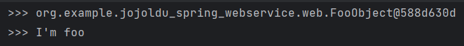
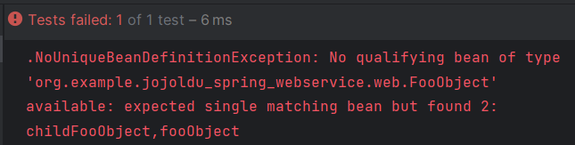
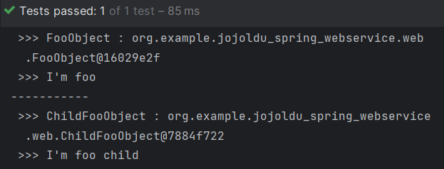
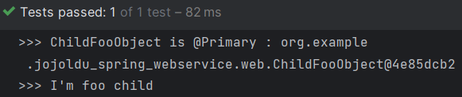
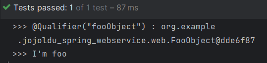
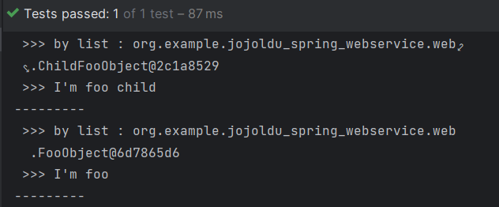

요즘 스프링공부중인데요\
_"이렇게 저렇게 해서 스프링 빈을 주입받습니다~"_ 라는 말을 정말 자주 봅니다\
그럼 저같은 머글들은 당연히도..\
**스프링 빈**이 도당체 뭔데?? 라고 생각하게 됩니다..\
모르겠으면 응당 알아보고 넘어가야겠죠?

# Spring Bean ?

[Spring docs](https://docs.spring.io/spring-framework/reference/core/beans/introduction.html)에서 말하는 bean이란...

> bean은 Spring IoC 컨테이너에 의해 생성(instanciatiate)되고, 조립(assemble)되며, 관리(manage)되는 객체입니다.

음... 저같은 사람은 **Spring IoC 컨테이너**가 뭔지도 모르니까 또 알아봐야겠는데요?

일단 기존의 Java Programming에서는 먼저 `class`를 작성하고, `new`로 객체를 인스턴스화하여 사용하는 구조였습니다. 사용자가 객체들을 직접 생성, 관리했던 것인데요\
Spring의 가장 큰 특징은 이 개념을 거꾸로 뒤집는다는 것입니다.\
객체의 생성과 유지, 관리를 사용자가 직접 하도록 하는 것이 아닌, 특별한 관리 주체에게 맡겨버리는 것인데요..\
이를 **제어의 역전(IoC, Inversion of Control)** 이라고 하며, 이 대신 관리해주는 주체가 **Spring IoC 컨테이너**입니다.

일단 Spring IoC 컨테이너에 **등록**되면 **Singleton**으로 단일 객체가 생성되어 관리되고, 사용자는 필요할 때 **주입**받아 사용합니다.

그럼 Spring Bean을 등록하는 법과 주입받는 법을 알아봐야겠는데요

# Spring Bean 등록

### 1. `@Component` 어노테이션(Annotation)

어노테이션은 소스코드에 메타데이터 정보를 추가해주는... 유사 인터페이스인데요\
가장 익숙할만한 것으로는 `@Override` 이런 것이 있겠죠?

스프링에서도 꽤나 많은 어노테이션들이 존재하고 매우 중하게 이용되며\
스프링 빈으로 등록하기 위해서는 `@Component` 어노테이션을 사용합니다.\
또한 `@Controller, @RestController, @Service, @Repository`등의 어노테이션 또한 `@Component`어노테이션을 내재하므로, 사용 시 스프링 빈으로 등록됩니다.

```java
@Target({ElementType.TYPE})
@Retention(RetentionPolicy.RUNTIME)
@Documented
@Component
public @interface Controller {

    /**
     * The value may indicate a suggestion for a logical component name,     * to be turned into a Spring bean in case of an autodetected component.     * @return the suggested component name, if any (or empty String otherwise)
     */    @AliasFor(annotation = Component.class)
    String value() default "";

}
```

위와 같이, `@Controller` 어노테이션의 구현부를 보면 `@Component` 어노테이션을 포함하고 있음을 확인할 수 있습니다.

### 2. 직접 Bean Configuration에 등록

또는 아래와 같이, `@Configuration`과 `@Bean` 어노테이션으로 설정파일 밑에 직접 스프링 빈을 등록할 수 있습니다.

```java
@Configuration
public class FooConfig {
	@Bean
	public FooObject fooObject() {
		return new FooObject();
	}
}
```

위에서 `@Component`어노테이션은 클래스에 사용했었지만, 이렇게 `@Bean` 어노테이션을 사용하면 메소드 단위로 빈으로 등록할 수 있습니다.

# Spring Bean 주입

스프링 빈을 등록했으면 어떻게 가져다 쓸지도 알아야겠죠?\
스프링 빈 객체를 주입받는다,\
또는 의존성을 주입받는다(**DI**, Dependency Injection)\
이런 식으로 말하는데요\
세 가지 방법이 있습니다

### 1. 필드

필드에 `@Autowired` 어노테이션을 붙여줍니다.

```java
@Autowired
private FooObject fooObject;
```

### 2. setter

`setter` 메소드를 사용합니다.

```java
private FooObject fooObject;

@Autowired
public void setFooObject(FooObject fooObject) {
	this.fooObject = fooObject;
}
```

### 3. 생성자 (권장)

스프링 빈 객체를 인자로 하는 생성자를 작성합니다. 이 경우 `@Autowired` 어노테이션은 생략될 수 있습니다.
클래스에 생성자가 하나만 존재하며 인자가 스프링 빈으로 등록된 객체이면 됩니다.
컨테이너가 알아서 생성자에 객체를 넣어주는 셈입니다.

```java
public class SimpleService {
	private final FooObject fooObject;

	public SimpleService(FooObject fooObject) {
		this.fooObject = fooOjbect;
	}
}
```

또한 lombok을 사용하는 경우, 클래스에 `@RequiredArgsConstructor` 어노테이션만 붙여주면 자동으로 `final` 필드들을 인자로 받는 생성자를 만들어주니 간단하게 사용할 수 있습니다.

스프링에서는 생성자 > setter > 필드 순으로 권장하고 있는데요\
생성자의 경우 객체 의존성도 꽤나 알아보기 쉽고 `final`의 특성상 일관성을 보장할 수 있는 등의 장점이 있습니다.\
그래도 setter의 경우 객체를 나중에 주입받거나 재주입받고 싶은 그런 상황에서 쓰일 수 있겠죠?\
본인 상황에 맞게 쓰면 될 것 같습니다

# 스프링 빈 주입 대상이 여럿이면 어쩌죠?

헉 그런 일이 있을까요? 싶지만\
주입 대상을 상속/구현하는 클래스가 또 여럿 있다면\
그 중 어떤 객체를 원하는지 모호하기 때문에 에러가 발생할 수 있습니다.

확인해볼까요? 먼저 간단히 `FooObject` 클래스에 `@Component`어노테이션을 붙여 스프링 빈 객체로 등록하고\
테스트 코드에서 간단히 `@Autowired` 필드 주입으로 해당 객체를 주입받습니다.

```java
@Component
class FooObject {
	public void printInfo() {
		System.out.println(" >>> I'm foo");
	}
}

@RunWith(SpringRunner.class)
@SpringBootTest
public class BeanTest {

	@Autowired
	private FooObject foo;

	@Test
	public void test() {
		System.out.println(" >>> " + foo);
		foo.printInfo();
	}
}
```

실행 결과는\
\
객체를 잘 주입받은 것 같습니다?

그런데 `FooObject`를 상속한 친구가 있다면 어떨까요?

```java
@Component
class ChildFooObject extends FooObject {
	@Override
	public void printInfo() {
		System.out.println(" >>> I'm foo child");
	}
}
```

이런 친구를 추가하고 아까와 똑같이 실행해보면\
\
헉.. 실패해부렀습니다\
`foo`에 `FooObject`를 넣고싶은건지, `ChildFooObject`를 넣고싶은건지 몰라서 에러가 났는데요\
그럼 "내가 원하는 객체는 저거야!"를 알려주는 방법을 알아봅시다

### 1. 필드 이름으로 매칭하기

위에서 `@Component`어노테이션을 붙여서 `FooObject`를 스프링 빈 객체로 등록했는데요\
이 경우 클래스 명에 대한 camelCase와 동일하게 필드 이름을 작성해주면 해당 객체로 매칭됩니다.

```java
@RunWith(SpringRunner.class)
@SpringBootTest
public class BeanTest {
	@Autowired
	private FooObject fooObject;
	@Autowired
	private FooObject childFooObject;

	@Test
	public void test() {
		System.out.println(" >>> FooObject : " + fooObject);
		fooObject.printInfo();
		System.out.println("-----------");
		System.out.println(" >>> ChildFooObject : " + childFooObject);
		childFooObject.printInfo();
	}
}
```



또는 `@Bean`으로 스프링 빈을 생성한 경우, 메소드 이름으로 스프링 빈 객체를 매칭할 수 있습니다.

### 2. `@Primary`

`@Primary` 어노테이션을 사용하여 우선순위를 최상위로 올립니다. 이 경우 자동으로 해당 객체를 우선 주입합니다.\
`ChildFooObject`에 어노테이션을 붙여보겠습니다.

```java
@Component
class FooObject {
	public void printInfo() {
		System.out.println(" >>> I'm foo");
	}
}

@Primary
@Component
class ChildFooObject extends FooObject {
	@Override
	public void printInfo() {
		System.out.println(" >>> I'm foo child");
	}
}

@RunWith(SpringRunner.class)
@SpringBootTest
public class BeanTest {

	@Autowired
	private FooObject foo;

	@Test
	public void test() {
		System.out.println(" >>> ChildFooObject is @Primary : " + foo);
		foo.printInfo();
	}
}
```



### 3. `@Qualifier`

`@Qualifier` 어노테이션으로 어떤 객체를 주입받을지 직접 알릴 수도 있습니다.\
주입을 원하는 클래스 명에 대한 camelCase를 어노테이션의 value로 집어넣습니다.

```java
@RunWith(SpringRunner.class)
@SpringBootTest
public class BeanTest {

	@Autowired
	@Qualifier("fooObject")
	private FooObject foo;

	@Test
	public void test() {
		System.out.println(" >>> @Qualifier(\"fooObject\") : " + foo);
		foo.printInfo();
	}
}
```



### 4. 모든 스프링 빈 객체 주입받기

전부 필요하면 어쩌죠?\
전부 받도록 합시다.\


```java
@RunWith(SpringRunner.class)
@SpringBootTest
public class BeanTest {

	@Autowired
	private List<FooObject> fooObjects;

	@Test
	public void test() {
		for(FooObject foo : fooObjects) {
			System.out.println(" >>> by list : " + foo);
			foo.printInfo();
			System.out.println("---------");
		}
	}
}
```



<br/>
<br/>

---

<br/>

스프링 빈 주입에 관해 정말 좋은 글이 있는데요.. 저도 참고 많이 했습니다\
[카카오페이 기술블로그 포스팅](https://tech.kakaopay.com/post/martin-dev-honey-tip-2/#6%EC%A4%84-%EC%9A%94%EC%95%BD)인데요\
카카오페이 시니어 개발자분께서 빈 주입에 대한 스프링 코드를 직접 뜯고 씹고 맛보고 즐겨주십니다\
오픈소스 코드도 까보고 해라.. 이런거는 항상 고수들께서 강조하시지만\
막상 하려면 또 잘 모르는 입장에서는 힘들고 부담이고 어디서부터 손대야할지도 모르겠는데\
코드 리뷰 흐름을 같이 손잡고 따라가게 해주시니 정말 도움이 많이 됩니다\
그 외에도 다른 이야기들과.. 테스트 코드 작성이나.. 결론이나.. 딱딱하지 않으면서도 전부 뼈가 되고 살이 될만한 내용들 뿐이니 한번쯤 보시면 어떤가 싶습니다

이만 마칩니다

## Reference

[스프링 빈(Spring Bean)이란? 개념 정리](https://melonicedlatte.com/2021/07/11/232800.html)\
[Spring Bean Injection 이야기(feat. 모두가 다 알고 있는 스프링빈, 정말 다 알고 있는가?)](https://tech.kakaopay.com/post/martin-dev-honey-tip-2/#6%EC%A4%84-%EC%9A%94%EC%95%BD)\
[[Spring] Bean 주입하기 : DI](https://girawhale.tistory.com/113)\
[Spring Docs](https://docs.spring.io/spring-framework/reference/core/beans/introduction.html)
